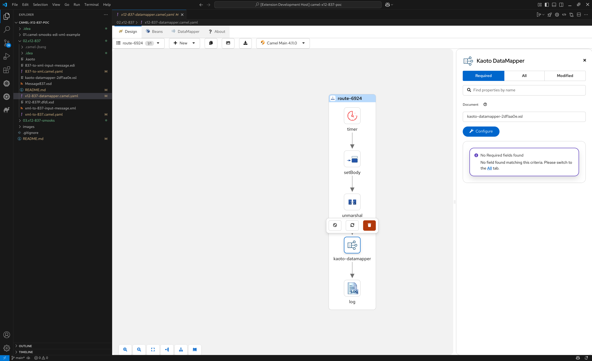

# X12 837 message handling with Camel PoC

The purpose of this PoC is to demonstrate reading and writing X12 837 EDI message in Camel Route with using Smooks DFDL support, as well as letting Kaoto DataMapper participate in.

The most important piece in this PoC is the [DFDL (Data Format Definition Language) schema file](02.x12-837/X12-837P.dfdl.xsd) which describes the ruleset for transforming between EDI data and XML. Since DFDL is just an **annotated XML schema**, once it's defined appropriately, it can be directly attached as a **Kaoto DataMapper Document schema**, and perform visual data mapping from that point. 

In this PoC, we only created [an example schema for X12 837P](02.x12-837/X12-837P.dfdl.xsd). We hope this PoC help you to start creating a real world solution for your X12 837P use case, handle other X12 transaction sets and even other standards such as EDIFACT in a similar way. 

## Prerequisites
### Kaoto Visual Studio Code extension
- [Download Extension Pack (Marketplace)](https://marketplace.visualstudio.com/items?itemName=redhat.apache-camel-extension-pack)
- [Official Site](https://kaoto.io/)

Kaoto extension is used to visually authoring Camel routes and configure the DataMapper step.

### Apache Daffodil Extension for Visual Studio Code
- [Download (Marketplace)](https://marketplace.visualstudio.com/items?itemName=ASF.apache-daffodil-vscode)
- [Documentation](https://github.com/apache/daffodil-vscode/wiki)

This extension is a powerful tool when authoring a DFDL schema file. Especially the  [Visual Debugger](https://github.com/apache/daffodil-vscode/wiki#daffodil-data-parse-debugger) provides the intermediate view of the transformed data model - infoset - along with the corresponding line in the DFDL schema file, and you can step forward line by line and see which line of the DFDL schema makes what data into the outcome.

### Camel JBang
- [Official Documentation](https://camel.apache.org/manual/camel-jbang.html)

This PoC uses Camel JBang to run the Camel routes.

## Contents
Here we have 3 separate camel routes:
### [Transform X12 837P to XML](02.x12-837/837-to-xml.camel.yaml)

This route flows as following:
1. Every 3 seconds, execute this route
2. Reads [X12 837P text input](02.x12-837/837-to-xml-input-message.edi) into the body
3. Transforms X12 837P input to the XML using Smooks DFDL
4. Prints the outcome

In the [Smooks config file](02.x12-837/837-to-xml.smooks-config.xml), the [DFDL schema file](02.x12-837/X12-837P.dfdl.xsd) is specified for the transformation. This DFDL schema file is the most important piece in this PoC, and also the most time taking part to create this PoC. The Daffodil Visual Studio Code extension helped a lot to debug the file and make it work.

To run this route using Camel JBang (assuming the CWD is [02.x12-837](02.x12-837)):
```
camel run --dep=org.smooks.cartridges:smooks-dfdl-cartridge:1.0.1 X12-837P.dfdl.xsd 837-to-xml*
```
The expected output is same as the [input XML file for xml-to-837 route](02.x12-837/xml-to-837-input-message.xml)

### [Transform XML to X12 837P](02.x12-837/xml-to-837.camel.yaml)

This route flows as following:
1. Every 3 seconds, execute this route
2. Reads [XML input](02.x12-837/xml-to-837-input-message.xml) into the body
3. Transform XML input to the X12 837P text using Smooks DFDL
4. Prints the outcome

Note that the [Smooks config file](02.x12-837/xml-to-837.smooks-config.xml) specifies the same [DFDL schema file](02.x12-837/X12-837P.dfdl.xsd) with the previous 837-to-xml route. Once it's defined appropriately, The DFDL schema works for both direction.

To run this route using Camel JBang (assuming the CWD is [02.x12-837](02.x12-837)):
```
camel run --dep=org.smooks.cartridges:smooks-dfdl-cartridge:1.0.1 X12-837P.dfdl.xsd xml-to-837*
```
The expected output is same as the [X12 837P text input file](02.x12-837/837-to-xml-input-message.edi)

### [X12 837P > XML > Kaoto DataMapper](02.x12-837/x12-837-datamapper.camel.yaml)

This route flows as following:
1. Every 3 seconds, execute this route
2. Reads [X12 837P text input](02.x12-837/837-to-xml-input-message.edi) into the body
3. Transforms X12 837P input to the XML using Smooks DFDL
4. **Perform data mappings with Kaoto DataMapper** and create a `Message837` XML out of X12 837P XML
5. Prints the outcome

This route is almost same with the previous 837-to-xml route. The only difference is the step 4, Kaoto DataMapper. The XML structure from Smooks DFDL output is described by the [DFDL schema file](02.x12-837/X12-837P.dfdl.xsd). We can attach the DFDL schema file directly as a Source Document schema. Also we created an [Message837 example XML schema](02.x12-837/Message837.xsd) to describe the output XML structure, and attached as a Target Document schema. This data mappings create the final `Message837` XML out of X12 837P XML.

We created an example data mappings as following:


To run this route using Camel JBang (assuming the CWD is [02.x12-837](02.x12-837)):
```
camel run --dep=org.smooks.cartridges:smooks-dfdl-cartridge:1.0.1 \
    X12-837P.dfdl.xsd \
    x12-837-datamapper.camel.yaml \
    837-to-xml-input-message.edi \
    837-to-xml.smooks-config.xml \
    kaoto-datamapper-2df1aa0e.xsl
```
Here is the expected XML output
```xml
<?xml version="1.0" encoding="UTF-8"?>
<Message837>
   <From>PREMIER BILLING SERVICE</From>
   <To>KEY INSURANCE COMPANY</To>
   <Date>20061015</Date>
   <Time>1023</Time>
   <HealthClaim>
      <SubmitterId>26463774</SubmitterId>
      <MonetaryAmount>100</MonetaryAmount>
      <HealthCareServiceLocationInfo>
         <FacilityCodeValue>11</FacilityCodeValue>
         <FacilityCodeQualifier>B</FacilityCodeQualifier>
         <ClaimFrequencyTypeCode>1</ClaimFrequencyTypeCode>
      </HealthCareServiceLocationInfo>
      <YesNoConditionOrResponseCodeFile>Y</YesNoConditionOrResponseCodeFile>
      <ProviderAcceptAssignmentCode>A</ProviderAcceptAssignmentCode>
      <YesNoConditionOrResponseCodeBenefits>Y</YesNoConditionOrResponseCodeBenefits>
      <ReleaseOfInformationCode>I</ReleaseOfInformationCode>
   </HealthClaim>
</Message837>
```

## References
- [Example: X12 837 - Health Care Claim: Professional - Commercial Health Insurance](https://x12.org/examples/005010x222/example-01-commercial-health-insurance) The example input message used in this PoC was created from this official example, wrapped with dummy `ISA`, `GS`, `GE` and `IEA` segments.
- [01.camel-smooks-edi-xml-example](01.camel-smooks-edi-xml-example)
Just a reference. it was copied from Smooks official example and wrapped into camel route. It is using EDIFACT common object. This was a starting point of this PoC.
- [Camel Smooks](https://camel.apache.org/components/next/smooks-component.html)
The Camel component to use Smooks
- [Apache Daffodil](https://daffodil.apache.org/)
The DFDL (Data Format Description Language) implementation. Smooks DFDL cartridge leverages Apache Daffodil underneath.


## TODO

- [x] Take Smooks edi-to-xml and xml-to-edi examples in to [](01.camel-smooks-edi-xml-example) and wrap into camel routes
- [x] Verify both edi-to-xml and xml-to-edi works
- [x] Copy [Smooks example files](01.camel-smooks-edi-xml-example) into [working dir](02.x12-837) and rename them to represent X12 837 usecase
- [x] Start making hands dirty - replace the example input payloads with X12 837 (input for 837-to-xml, output for xml-to-837)
- [x] Create  [DFDL schema file](02.x12-837/837-to-xml-order-mapping.dfdl.xsd) to convert 837 to XML
- [x] Execute 837-to-xml and save generated XML as [xml-to-837-input-message.xml](02.x12-837/xml-to-837-input-message.xml)
- [x] Make sure it runs and prints the log as expected. In theory the created DFDL schema should work for the other way as well, i.e. xml-to-837
- [x] Add DataMapper, so not only just convert between X12 837 and XML, but also demonstrate to read/write from/to a different data shape
- [x] Verify it runs and prints the log as expected

